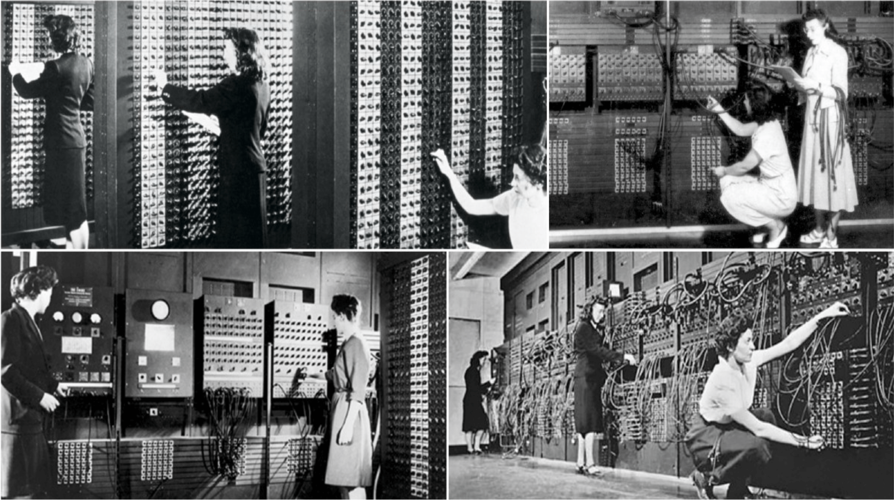
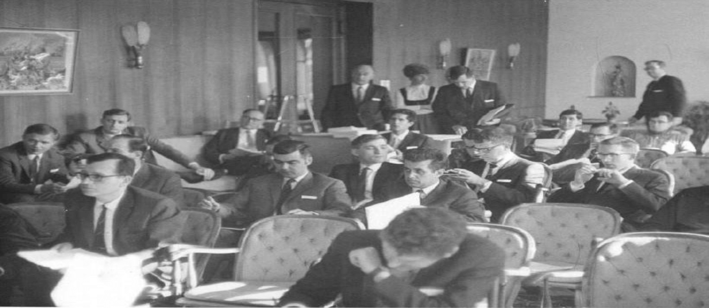
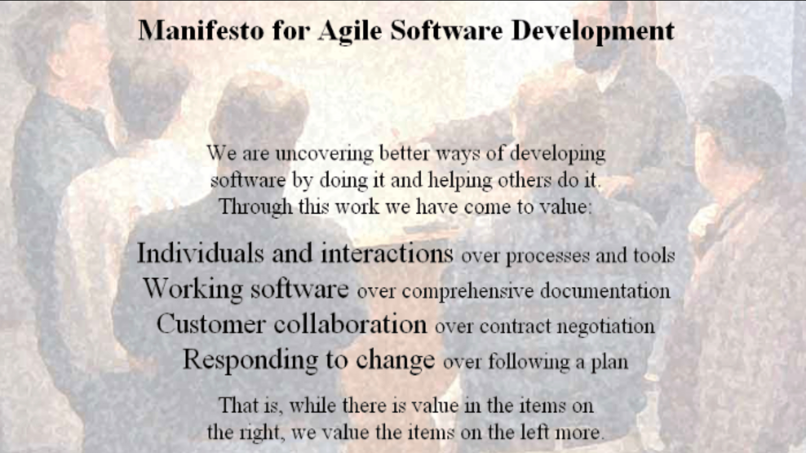

# DevOps

Nesse capítulo vamos aprender sobre o que é DevOps e entender sua história e motivação. Aprenderemos sobre os problemas recorrentes na área de tecnologia, em especial na área de desenvolvimento de software, que foram a grande inspiração para a criação da filosofia DevOps.

Também vamos discutir sobre alguns dos principais mitos a respeito desse tema e porque não devemos nos preocupar com eles.

## O que é DevOps

DevOps é um conceito um pouco complicado de explicar e definir, pois existem diversas opiniões distintas sobre ele na literatura e internet, e também por se tratar de algo bastante subjetivo, pois cada profissional e empresa possui um ambiente e contexto totalmente diferente, possuindo assim experiências distintas sobre o tema.

Na nossa opinião, gostamos de definir DevOps da seguinte maneira:

> **Filosofia** que une os **valores**, **princípios**, **práticas** e **ferramentas** dos times de desenvolvimento e operações de uma empresa, com o objetivo de aumentar sua capacidade e **agilidade** de **inovação**, por meio da criação e manutenção de produtos de tecnologia, fazendo assim com que ela se torne mais competitiva no mercado.

Repare que é uma definição um pouco abstrata, da mesma forma que encontramos a definição de metodologias ágeis e do próprio manifesto ágil, pois a ideia não é te induzir a uma única maneira de fazer DevOps, focando em determinadas praticas e ferramentas, mas sim entender os princípios e valores por trás delas.

Ao longo desse capítulo vamos estudar sobre a história do DevOps, algo que vai facilitar bastante no entendimento da nossa visão e definição dele.

## A história do desenvolvimento de software

Para entender melhor o que é DevOps é necessário voltar ao passado, entendendo como a nossa área nasceu, evoluiu e chegou aos problemas aos quais o DevOps veio para tentar resolver.

Voltaremos então ao ano de 1943, no qual ocorreu um grande marco para a área de desenvolvimento de software, pois nele iniciou-se um dos projetos de software mais famoso do mundo, que foi o projeto **ENIAC**.

### ENIAC - Electronic Numerical Integrator and Computer

Em 1943, durante a 2ª guerra mundial, o governo dos Estados Unidos da América iniciou um projeto secreto, com o objetivo de criar uma máquina capaz de realizar cálculos balísticos complexos em poucos segundos.

Nasce assim o projeto que ficou conhecido como **Electronic Numerical Integrator and Computer**, abreviado de **ENIAC**.

Alguns engenheiros da Universidade de Pennsylvania foram responsáveis por construir o hardware do ENIAC, que pesava quase 30 toneladas e ocupava uma área de quase 170 metros quadrados.

Após o hardware ser concluído, foi necessário o desenvolvimento de um software para operá-lo, sendo que seis mulheres matemáticas participaram desse projeto e assim criaram o primeiro sistema de computador eletrônico programável do mundo, que foi desenvolvido sem o uso de linguagens de programação ou quaisquer ferramentas, utilizando apenas diagramas lógicos e dispositivos eletrônicos.

Naquela época a indústria focava apenas em hardwares, sendo que quando problemas surgiam os engenheiros de hardware costumavam dizer: “O problema não é o hardware, mas quem está o operando”.

O projeto ENIAC foi concluído em 1945 e seu primeiro teste real foi realizado no dia 10 de dezembro desse mesmo ano.

Esse foi o marco de início de uma nova área, focada no desenvolvimento de softwares para controle de hardwares.

> **ENIAC Programmers Project**
> 
> Embora o software do ENIAC tenha sido desenvolvido por seis mulheres, que são consideradas como pioneiras da área de desenvolvimento de software, elas nunca tiveram o merecido reconhecimento e suas histórias ficaram perdidas no passado.
>
> Kathy Kleiman, uma jovem desenvolvedora de softwares, iniciou nos anos 90 uma busca pela verdadeira história por trás do desenvolvimento do software do ENIAC e criou um projeto chamado **ENIAC Programmers Project**, com o objetivo de resgatar e divulgar a história perdida das seis desenvolvedoras que participaram da construção do software do ENIAC.
>
> Para saber mais sobre esse projeto acesse o site: https://eniacprogrammers.org

### Projeto Apollo

Após o projeto ENIAC ser concluído, milhares de outros projetos de software foram iniciados ao redor do mundo, sendo que na década de 60 um desses projetos era bastante ambicioso e com grande impacto mundial.

Em 1961 o presidente americano John Kennedy anunciou que em 10 anos os Estados Unidos da América levariam uma pessoa à lua, a trazendo de volta para a Terra em segurança. Criou-se então um projeto, batizado de Apollo, sendo sua missão atribuída à NASA.

Para realizar tal missão a NASA precisava construir um foguete e também de alguém capaz de desenvolver um software complexo para controle aéreo, que seria utilizado nesse foguete a ser enviado à lua.

Margaret Hamilton, uma matemática do MIT, foi a pessoa escolhida como responsável por chefiar a equipe de desenvolvimento de tal software.

Devido às limitações de hardware do módulo lunar, o software que Margaret e sua equipe desenvolveram era flexível a ponto de permitir que ele pudesse ser sobrescrito manualmente, para que o piloto o controlasse utilizando controles manuais.

O projeto foi concluído em 1969 e o foguete foi lançado da terra em 16 de julho desse mesmo ano, retornando para a terra no dia 24 de julho, após oito longos dias de missão no espaço.

Durante o desenvolvimento do software, Margaret Hamilton definiu alguns itens como sendo críticos para garantir sua qualidade, tais como:

* Debug individual de todos os componentes;
* Testes individuais de todos os componentes; e
* Testes de integração entre os componentes.

Nasce assim o termo **Software Engineering**, na qual Margaret Hamilton foi uma das pioneiras em especializar e profissionalizar a então nova área de desenvolvimento de softwares, que estava ficando cada vez mais popular e utilizada no mundo inteiro.

> **O primeiro projeto DevOps do mundo?**
> 
> Graças à liberdade, autonomia, confiança e respeito entre todas as pessoas envolvidas no projeto Apollo, a missão foi bem-sucedida.
>
> Ao ler sobre a história do Apollo é possível identificar como os valores e princípios do modelo DevOps ali estavam presentes e contribuíram bastante para o sucesso do projeto como um todo.
>
> Sendo assim, podemos considerar o Apollo como sendo o primeiro projeto DevOps do mundo, embora naquela época esse termo sequer existia :)

### Software Crisis

Embora os projetos ENIAC e Apollo tenham sido bem-sucedidos, ao redor do mundo a grande maioria dos projetos de software fracassava e muitos problemas começaram a surgir, visto que essa era uma área nova e que não seguia os padrões das outras engenharias.

Em 1967 o `NATO Science Committee` criou um grupo de estudos sobre Ciência da Computação, formado por cientistas de diversos países e indústrias, com o objetivo de discutir sobre o estado atual da área de engenharia de software.

Foram formados três grupos focados em discutir sobre projeto de software, desenvolvimento de software e operação de software, com objetivos de definir, descrever e começar a pensar em como resolver os problemas da engenharia de software.

Em 1968 ocorreu a primeira `NATO Software Engineering Conference`, na qual foram identificados os principais problemas da engenharia de software, dentre eles:

* Definição e métricas de sucesso do projeto;
* Softwares complexos que exigem investimentos altos e viabilidade incerta;
* Entregar projetos dentro do orçamento previsto;
* Entregar projetos no prazo previsto; e
* Entregar projetos de acordo com as especificações.

Nessa conferencia se cunhou então o termo **Software Crisis**, para descrever o cenário problemático atual da área de engenharia de software.

Posteriormente, a partir de 1979, a tecnologia começou a evoluir bastante, em especial na área de redes, na qual empresas e universidades estavam utilizando novas tecnologias para compartilhar informações.

Entretanto, compartilhar informações não era visto com bons olhos pelas empresas, pois elas não queriam que seu modo de operar fosse exposto, pois ele era considerado como informação estratégica.

Esse **isolamento** entre as empresas acabou levando a um aumento na complexidade de seus sistemas, algo que motivou a necessidade de especialização de perfis e aumento no número de papéis relacionados a área de tecnologia.

E assim se inicia, infelizmente, o surgimento de **silos**, dentro da área de tecnologia, pois de um lado estavam os **engenheiros de software**, especializados na criação e manutenção de produtos, e do outro estavam os **sysadmins**, especializados no gerenciamento dos sistemas.

Cada um desses dois perfis têm habilidades e necessidades distintas, sendo que em situações de problemas, é comum que não haja uma colaboração entre eles.

Aqui foi justamente onde a engenharia de software “desandou”, algo bem diferente do que aconteceu no projeto Apollo.

O problema foi que as tecnologias de software evoluíram muito rapidamente, forçando as empresas a aumentarem sua flexibilidade e velocidade de evolução, para continuarem competitivas no mercado.

Mas essa velocidade de evolução e necessidade de constantes mudanças causou problemas e atritos entre as equipes de desenvolvedores e sysadmins, pois ela afetava a estabilidade nos sistemas e aumentava o risco de problemas surgirem.

E com isso se inicia uma nova era de grande **resistência às mudanças**.

### Agile Manifesto

Após um tempo de caos e diversos problemas recorrentes na área de engenharia de software, nasce um movimento denominado **Agile**, com o manifesto ágil publicado em 2001.

O manifesto ágil surgiu de uma reunião entre 17 engenheiros de software que buscavam por melhores formas de desenvolver softwares e como lidar com os problemas enfrentados no mercado.

Nesse encontro eles compartilharam seus valores e princípios, e também como acreditavam que o desenvolvimento de softwares deveria ser, sendo comum entre ele um foco grande em **ciclos de release curtos**, **adaptação às mudanças** e forte **ênfase nas pessoas**.

Algumas metodologias de desenvolvimento de software alinhadas ao manifesto ágil foram surgindo e se popularizando. Dentre elas: Scrum, XP e Kanban.

Esse foi um grande marco na história da área de desenvolvimento de software, pois o manifesto e as metodologias ágeis resgataram os valores e princípios da época do projeto Apollo, aumentando bastante com isso o sucesso dos projetos de software ao redor do mundo.

## A história do DevOps

Agora que já aprendemos sobre a origem, evolução e problemas enfrentados pela área de desenvolvimento de software, vai ficar mais fácil de entender o que motivou o movimento DevOps.

### Dev vs. Ops

Mesmo com o manifesto e as metodologias ágeis sendo utilizadas como principal abordagem para o desenvolvimento de softwares, alguns problemas ainda persistiam no mercado.

O grande problema é que a área de operações, também conhecida como infraestrutura, era tratada de maneira **isolada** da área de desenvolvimento, o que acabou criando um **silo** entre essas duas áreas.

De um lado está o time de desenvolvimento, trabalhando de maneira ágil, buscando autonomia e necessitando de ciclos de release cada vez mais curtos, mas do outro lado está o time de operações, que possui outro ritmo de trabalho e processos que exigem mais controle, governança e estabilidade.

São duas áreas com ideias, necessidades e processos distintos, que às vezes podem entrar em conflito, gerando um atrito entre esses dois times.

O resultado desse conflito foi a perda de agilidade da empresa em inovação, o que geralmente a fazia perder o **Time to Market** ao tentar desenvolver uma nova ideia de negócio.

A única maneira de resolver tal situação era então juntar os times de desenvolvimento e operações, fazendo com que eles trabalhassem como um time só, com metas compartilhadas e entendendo suas necessidades, problemas, valores e princípios, para que assim pudessem pensar juntos em como resolver os problemas e melhorar a capacidade e agilidade de inovação de sua empresa.

Foi justamente para resolver esses problemas que alguns sysadmins começaram a se interessar pelo tema `Agile` e foram buscar por maneiras de o utilizar também na área de infraestrutura.

### Agile Infrastructure

Em 2008, no evento `Agile Conference`, Patrick DuBois and Andrew Schafer se reuniram para discutir sobre um tópico pouco explorado na comunidade: **Agile Infrastructure**.

Eles discutiram e trocaram experiências sobre os problemas e frustrações que haviam passado em suas empresas, ao tentar levar o mindset do movimento `Agile` para a área de operações e ao tentar unir os times de desenvolvimento e operações. Posteriormente eles criaram um grupo de discussões para compartilhar suas ideias com outras pessoas ao redor do mundo.

Patrick Debois palestrou no evento com o tema "Agile Infrastructure and Operations: how infra-gile are you?", sendo que sua palestra foi para contar sua experiência em utilizar os conceitos de Agile em três projetos dos quais ele participou. Os slides de sua palestra podem ser acessados em: http://www.jedi.be/presentations/agile-infrastructure-agile-2008.pdf

No ano seguinte, em 2009, na O’Reilly Velocity Conference, John Allspaw e Paul Hammond, ambos do Flickr, deram uma palestra com o tema "10+ Deploys per Day: Dev and Ops Cooperation at Flickr", contando sobre suas experiências de trabalho no Flickr, onde eles conseguiram unir os times de desenvolvimento e operações, conseguindo com isso ter um ambiente onde eram realizados mais de 10 deploys ao dia, algo que naquela época era bem inovador e difícil de se ver no mercado.

E assim começa a nascer e crescer o interesse das pessoas sobre o tema **Agile Infrastructure**, para então tentar resolver os conflitos entre os times de Dev e de Ops, gerando melhores resultados para suas empresas.

Patrick Debois não pôde ir ao evento para prestigiar a palestra de John Allspaw e Paul Hammond, mas assistiu remotamente a transmissão e ficou muito empolgado e feliz em ver que diversas outras pessoas e empresas estavam interessadas pelo tema que ele se apaixonou um ano antes.

### DevOps Days

Ainda em 2009, Patrick Debois decidiu criar um evento para reunir pessoas interessadas pelo assunto e que também quisessem compartilhar suas experiências.

O evento foi batizado de **DevOps Days**, na qual sua primeira edição ocorreu na Bélgica, terra natal de Patrick Debois, e foi fortemente divulgado na internet via Twitter, sendo que para isso foi necessário a criação de uma `hashtag`.

A ideia era utilizar o próprio nome do evento como hashtag, mas preferiu-se remover a palavra `days`, e com isso a hashtag utilizada foi: **DevOps**.

E foi justamente assim que surgiu o termo DevOps, o qual Patrick Debois é considerado um dos pioneiros e que rapidamente se espalhou pelo mundo, sendo adotando por milhares de empresas.

Perceba então que agora que entendemos história, motivação e origem do DevOps, fica mais fácil de entender o que ele é, e o porquê dele ter sido criado.

DevOps pode ser considerado também com uma **extensão** do Agile, para contemplar também a área de infraestrutura e deixa-la mais alinhada com a área de desenvolvimento, fazendo assim que que essas duas áreas trabalhem de maneira similar e com muita colaboração, para que assim consigam entregar mais resultados para a empresa como um todo.

## DevOps Anti-Patterns

## A cultura em um ambiente DevOps

## O papel das ferramentas em um ambiente DevOps
