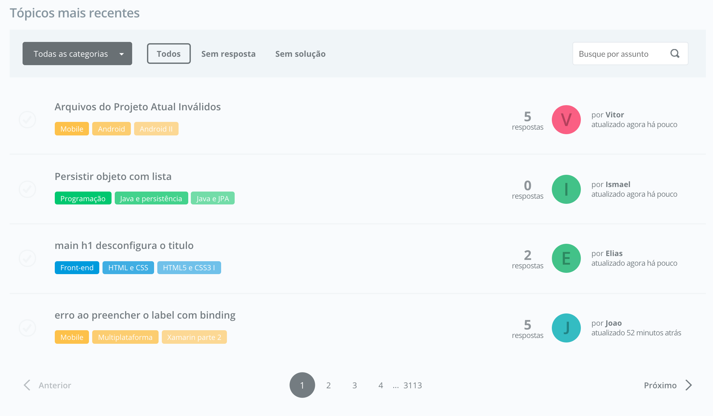
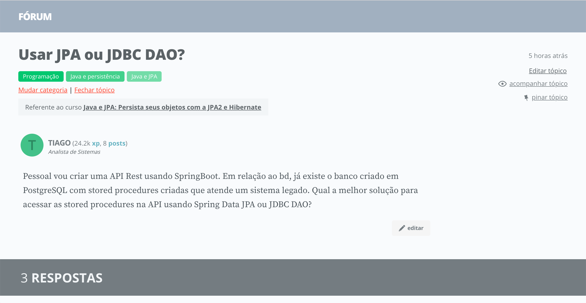
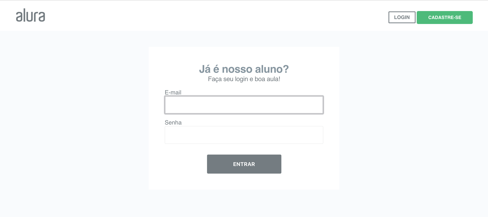
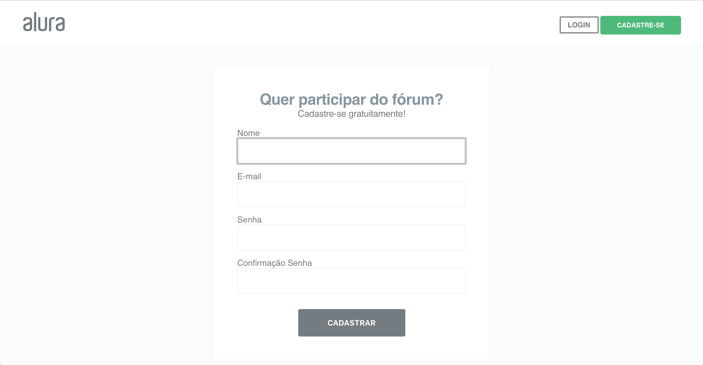
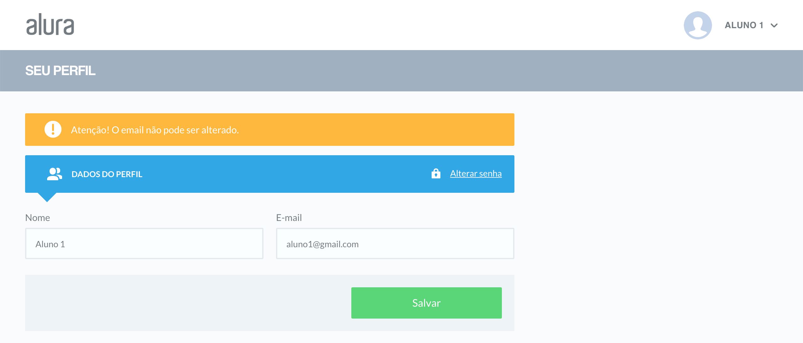

# O projeto do curso

Neste capítulo vamos conhecer a aplicação que trabalharemos durante o curso e aprenderemos como fazer para executá-la localmente.

## Alura Fórum: o fórum da plataforma Alura

A Alura é a plataforma de treinamentos de tecnologia do grupo Caelum, criada em 2011, focada em treinamentos na modalidade online.

Sua missão é criar uma plataforma de aprendizado de tecnologia, na qual as pessoas possam discutir, participar e enriquecer seus conhecimentos.


Uma das funcionalidades da plataforma é o **fórum** de discussões, onde os alunos podem abrir tópicos para tirar dúvidas sobre os cursos ou trocar ideias sobre algum assunto em específico.

Esse fórum de discussões será justamente a aplicação que utilizaremos de exemplo ao longo do curso.


Obs: A aplicação que utilizaremos no curso é uma versão simplificada do fórum real da plataforma Alura, contendo apenas um subconjunto de suas funcionalidades.

## As funcionalidades da aplicação

Vamos agora conhecer um pouco sobre as funcionalidades da aplicação do fórum da alura.

### Lista de tópicos

Uma das funcionalidades do fórum é uma lista contendo todos os tópicos que foram cadastrados pelos alunos e ainda não foram fechados, ou seja, ainda podem ser visualizados e os alunos podem interagir com ele.



A lista possui algumas informações de cada tópico, como seu título, autor e número de respostas, além de também possuir alguns filtros e paginação dos resultados.

Essa funcionalidade é pública, ou seja, não é necessário estar autenticado para poder acessá-la.

### Detalhes do tópico

Ao clicar em algum tópico, somos redirecionados para uma outra página que mostra mais detalhes dele, além de mostrar também as respostas que ele teve, um formulário para o cadastro de novas respostas e alguns links para executar ações no tópico, como por exemplo fechá-lo ou marcar uma resposta como sendo a solução.




Essa funcionalidade é parcialmente pública. Usuários não autenticados podem apenas visualizar as informações do tópico, mas não podem interagir com ele.

Para cadastrar uma resposta é necessário estar autenticado na aplicação.

Um outro detalhe importante é que somente o usuário que cadastrou o tópico, ou um usuário com perfil de *moderador*, tem permissão para fechá-lo ou para marcar uma resposta como sendo a solução.

### Login

A aplicação também possui uma funcionalidade para que usuários previamente cadastrados possam se autenticar.



### Cadastro

Qualquer pessoa pode se cadastrar livremente no fórum, para poder participar das discussões.



Um detalhe aqui é que o email deve ser único no sistema, ou seja, um usuário não pode se cadastrar utilizando o email de outro usuário já cadastrado.

### Editar perfil

A aplicação possui uma tela para editar o perfil do usuário, na qual ele poderá alterar seus dados pessoais, bem como alterar sua senha de acesso.




Para acessar essa funcionalidade o usuário precisa estar autenticado na aplicação.

## Como rodar a aplicação?

Agora que já conhecemos a aplicação que vamos trabalhar ao longo do curso, precisamos baixar seu código fonte para poder fazer o build e o deploy dela.

## Código fonte do projeto

O primeiro passo será baixar o código fonte da aplicação e configurar o ambiente de desenvolvimento.

A nossa aplicação foi desenvolvida em *Java* e seu código-fonte está hospedado no *GitLab*, podendo ser acessado pelo seguinte endereço: https://gitlab.com/aovs/projetos-cursos/do25-alura-forum

Para baixá-la em nosso computador será necessário a utilização do *Git*.

## Exercício: download do código fonte da aplicação

1. Abra o `terminal` e rode o seguinte comando para baixar o código fonte da aplicação:

	```
	git clone https://gitlab.com/aovs/projetos-cursos/do25-alura-forum
	```

2. Acesse o diretório `home` e verifique se uma pasta chamada `do25-alura-forum` foi criada e dentro dela se encontram os arquivos da aplicação.

## Build do projeto

Após baixar o projeto precisamos configurá-lo para então conseguir realizar o build dele.

A configuração deve ser feita importando o projeto em uma `IDE Java`, que nosso caso será o *Eclipse*, e realizando nela também a configuração do servidor de aplicações `Tomcat`.

Feito isso, já será possível realizar o build da aplicação para termos um pacote que poderá ser colocado em produção. Entretanto, existem algumas etapas que devemos seguir para conseguir realizar o build de maneira correta.

Para facilitar esse processo a equipe de desenvolvimento criou um documento explicando o passo a passo necessário para realizar o build da aplicação, chamado de **Manual do Build**, ao qual devemos seguir, evitando assim possíveis problemas.

## Exercício: build manual da aplicação

1. Acesse o diretório do curso e abra o documento **manual-build.pdf**.

1. Siga as instruções desse manual para realizar o build da aplicação.

1. Em caso de dúvidas ou dificuldades peça ajuda ao instrutor.

## Deploy do projeto

Após realizar o build da aplicação agora devemos realizar o deploy dela, sendo que para isso devemos configurar toda a infra estrutura necessária.

Como esse processo é um pouco complicado e sujeito a erros, a equipe de Ops também criou um documento com as instruções para realizar tal atividade, o qual é chamado de **Manual do Deploy**.

Devemos seguir esse manual para conseguir simular um ambiente de produção, utilizando máquinas virtuais, com todas as configurações de infra estrutura necessárias para que a aplicação possa ser executada normalmente.

## Exercício: deploy manual da aplicação

1. Acesse o diretório do curso e abra o documento **manual-deploy.pdf**.

1. Siga as instruções desse manual para realizar o deploy da aplicação.

1. Em caso de dúvidas ou dificuldades peça ajuda ao instrutor.
