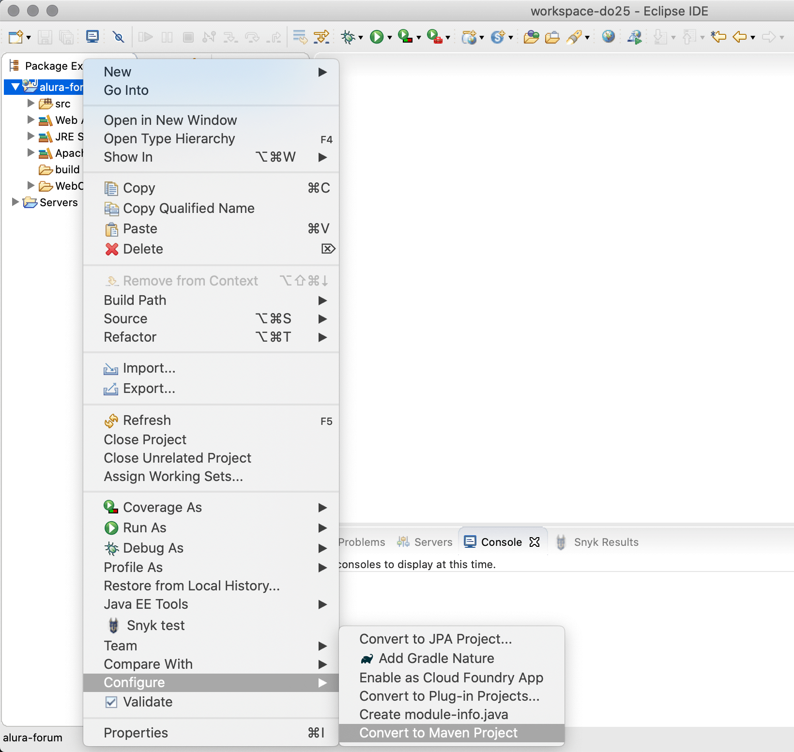
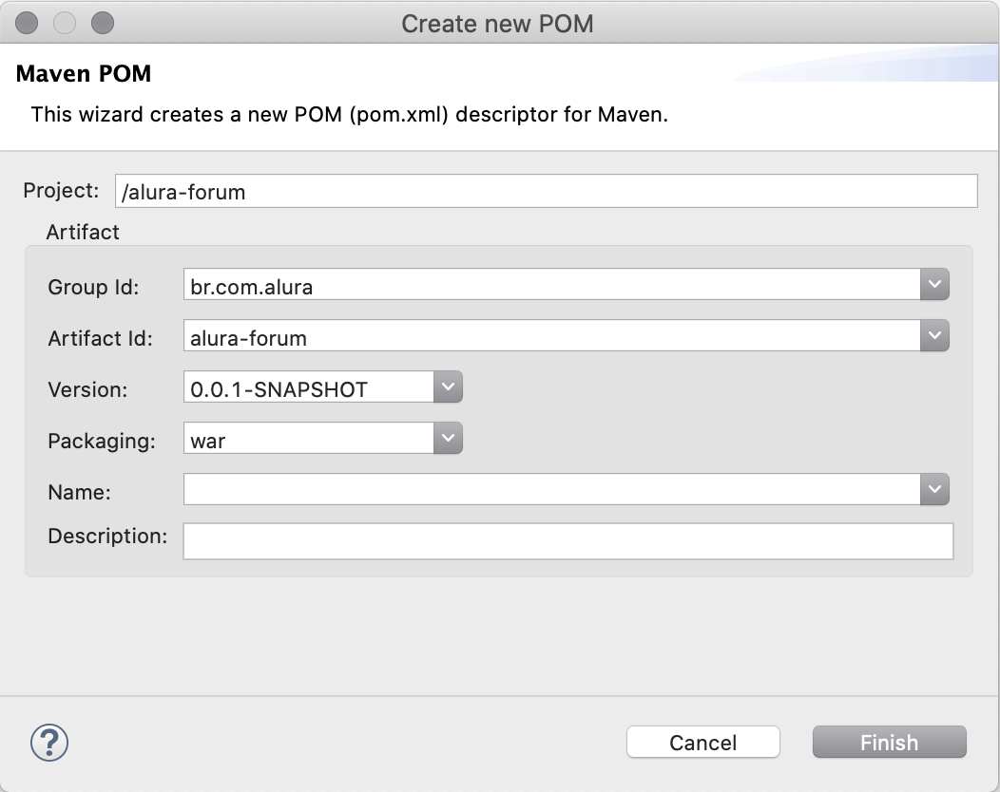
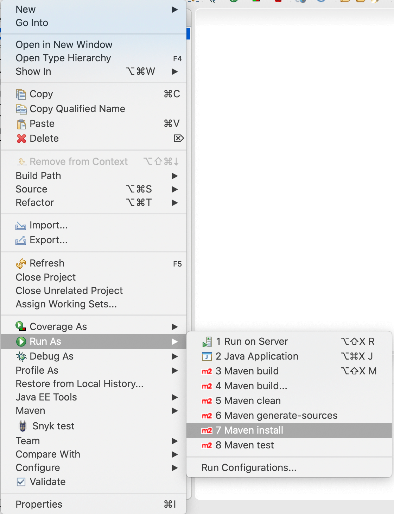
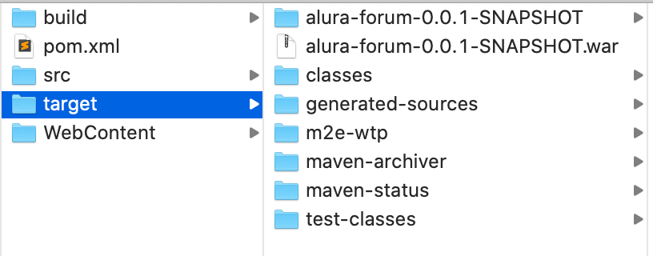

# Build automatizado

Neste capítulo vamos discutir sobre a importância da automatização do build em uma aplicação, além de aprender a como automatizar o build da aplicação utilizada como exemplo no curso.

## Build

Para desenvolver uma aplicação a equipe de desenvolvimento precisa escrever o código fonte dela, que vai conter as lógicas de negócio específicas da aplicação, além do código de infra estrutura necessário para suportá-la.

Mas uma aplicação não é feita apenas do código fonte escrito em alguma linguagem de programação, como Java, PHP ou Ruby, mas também de outros arquivos utilitários.

Em uma aplicação Web, por exemplo, também são necessárias as páginas HTML, arquivos de estilos CSS, arquivos JavaScript, imagens, dentre outros.

E além disso, também é comum que a equipe de desenvolvimento utilize bibliotecas e frameworks para facilitar o desenvolvimento da aplicação, juntamente com arquivos de configurações.

Mas quando a aplicação estiver pronta para ir à produção será necessário **transformar** todos esses milhares de arquivos em uma espécie de *pacote*, que será o arquivo *binário* a ser instalado e executado no servidor da aplicação.

Esse processo de converter todo o código fonte da aplicação no pacote a ser instalado no servidor é chamado de **build**, sendo que ele pode variar de aplicação para aplicação e também de acordo com a linguagem de programação e bibliotecas utilizadas.

Perceba então que esse processo de realizar o build da aplicação é algo que o time de desenvolvimento precisa realizar com bastante frequência, principalmente em ambientes alinhados com a cultura ágil e DevOps, que exigem ciclos de entregas mais curtos.

Isso faz com que o processo de build de uma aplicação seja considerado como algo *crítico*, devendo o time de desenvolvimento buscar maneiras de minimizar os erros que podem acontecer nele.

## Os problemas do build manual

É muito comum encontrar aplicações cujo processo de build é realizado de maneira manual, ou seja, com alguma pessoa do time de desenvolvimento seguindo um *passo a passo* de tarefas que precisam ser realizadas para gerar o artefato final do build.

Isso foi exatamente o que fizemos no capítulo anterior, ao gerar o build da aplicação do fórum da Alura, o qual inclusive utilizamos o documento chamado **manual do build**, detalhando o passo a passo para realizar o build da aplicação.

O problema dessa abordagem é que ela gera um risco elevado de erros acontecerem, uma vez que o processo de build de uma aplicação pode ser algo complexo e que envolva dezenas de passos a serem seguidos.

Caso uma pessoa do time esqueça de realizar algum dos passos ou o realize de maneira incorreta, teremos um artefato final incompleto ou com erros que podem prejudicar as pessoas que utilizam a aplicação.

Um exemplo clássico de erro comum que pode acontecer ao se ter um processo manual de build, é o de fazer o deploy da aplicação em ambiente de **produção**, mas com as configurações de banco de dados do ambiente de **desenvolvimento**.

Você já passou por isso antes ou conhece alguém que tenha passado? Quais os impactos negativos que isso pode gerar para o time de desenvolvimento, para a área de tecnologia e até mesmo para a própria empresa?

## Automatização do processo de build

Perceba que existe um grande risco de problemas acontecerem ao se realizar o build da aplicação de maneira manual. O ideal é buscar por maneiras de automatizar tal processo.

O processo de build de uma aplicação nada mais é do que uma sequência de passos a serem executados de maneira sequencial, para produzir o artefato final, sendo que normalmente essa sequência de passos é sempre executada da mesma maneira.

Tais passos podem incluir atividades como:

* Compilar o código fonte;
* Executar testes automatizados;
* Criar, copiar, mover, renomear ou remover arquivos e/ou diretórios;
* Executar scripts;
* Gerar o pacote final da aplicação;
* Etc.

Por conta dessa característica repetitiva, na qual os passos são sempre executados da mesma maneira, temos a possibilidade então de automatizar esse processo.

Em um ambiente DevOps a automatização do processo de build se torna algo de grande valor para o time, pois além de eliminar as chances de erros humanos, também vai gerar mais **agilidade**, pois uma máquina é infinitamente mais rápida do que qualquer pessoa.

## Build tools

Existem diversas ferramentas para automatização de build, chamadas de **Build Tools**, que podemos utilizar em nossas aplicações. Elas podem variar de acordo com a linguagem de programação e bibliotecas utilizadas pela aplicação.

Algumas delas são:

* Maven(Java)
* Webpack(JavaScript)
* Rake(Ruby)
* PyBuilder(Python)
* MSBuild(.NET)

Geralmente as ferramentas de build são configuráveis, permitindo que o time de desenvolvimento possa customizar o processo de build de cada aplicação, podendo cada uma delas ter o processo totalmente distinto das outras.

Hoje em dia é praticamente obrigatória a utilização de alguma ferramenta de build, sendo raro encontrar alguma aplicação que não utilize tal solução.

Caso sua aplicação não utilize uma ferramenta de build, o recomendado é escolher alguma delas e começar a utilizá-la o quanto antes.

## Automatizando o build do fórum da Alura

A aplicação utilizada como exemplo no curso, o fórum da Alura, não está utilizando nenhuma ferramenta de build, forçando assim que o processo de build seja executado de maneira manual.

Nosso trabalho agora é adicionar nela alguma das ferramentas de build e então configurar o processo de build dela, conforme fizemos de maneira manual, seguindo o manual do build.

Como se trata de uma aplicação Java, utilizaremos o Maven como ferramenta de build, que é uma das opções mais comuns e populares no Java.

### Maven

Maven é uma ferramenta utilizada para automatizar o processo de build de uma aplicação Java, além de conter outras funcionalidades, como o gerenciamento das dependências.

As configurações do Maven na aplicação são feitas em um arquivo no formato `XML`, chamado `pom.xml`, que deve ser criado no diretório raiz da aplicação.

Nesse arquivo devemos configurar as informações sobre a aplicação, o tipo de empacotamento dela, as dependências dela, dentre outras inúmeras possíveis configurações.

Veja a seguir um exemplo do arquivo `pom.xml`:

```xml
<project xmlns="http://maven.apache.org/POM/4.0.0"
	xmlns:xsi="http://www.w3.org/2001/XMLSchema-instance"
	xsi:schemaLocation="http://maven.apache.org/POM/4.0.0 http://maven.apache.org/xsd/maven-4.0.0.xsd">

	<modelVersion>4.0.0</modelVersion>
	<groupId>br.com.caelum</groupId>
	<artifactId>alura-forum</artifactId>
	<version>1.0</version>
	<packaging>war</packaging>

	<properties>
		<project.build.sourceEncoding>UTF-8</project.build.sourceEncoding>
		<project.reporting.outputEncoding>UTF-8</project.reporting.outputEncoding>
		<java.version>1.8</java.version>
	</properties>

	<dependencies>
		<dependency>
			<groupId>org.springframework</groupId>
			<artifactId>spring-webmvc</artifactId>
			<version>4.3.0.RELEASE</version>
		</dependency>

		<dependency>
			<groupId>org.hibernate.javax.persistence</groupId>
			<artifactId>hibernate-jpa-2.1-api</artifactId>
			<version>1.0.0.Final</version>
		</dependency>

		<dependency>
			<groupId>mysql</groupId>
			<artifactId>mysql-connector-java</artifactId>
			<version>5.1.15</version>
		</dependency>
	</dependencies>
</project>
```

Para mais informações sobre o Maven e seu funcionamento, acesse o seu site em: https://maven.apache.org

## Exercício: Adicionando o Maven ao projeto

Nesse exercício vamos adicionar e configurar o Maven em nossa aplicação.

1. O primeiro passo será converter o projeto para o `Maven`, sendo que isso pode ser feito diretamente no Eclipse, clicando com o botão direito no projeto e selecionando a opção: `Configure -> Convert to Maven Project`.



2. Na tela que será exibida devemos preencher algumas informações para o Maven, conforme a imagem a seguir:



3. O próximo passo é configurar as dependências do projeto no arquivo `pom.xml`. Já deixamos o arquivo preenchido no diretório do curso, portanto apenas substitua o arquivo atual pelo arquivo disponibilizado.

4. Por fim, devemos apagar **todos** os arquivos `.jar` do diretório `WebContent/WEB-INF/lib`.

5. Pronto! O projeto agora já foi convertido para o Maven e deveria estar funcionando normalmente. Caso algum erro esteja aparecendo no projeto no Eclipse, peça auxilio ao instrutor.

## Exercício: Isolando os datasources com profiles

Nesse exercício vamos adicionar na aplicação o conceito de **Profiles**, para isolar as configurações dos bancos de dados de desenvolvimento e produção, evitando assim que isso tenha que ser feito manualmente no build.

1. No pacote **br.com.alura.forum.config** crie uma classe chamada **DataSourceConfiguration**:

```java
@Configuration
public class DataSourceConfiguration {

}
```

2. Abra a classe **JPAConfiguration** procure pelos dois métodos chamados **datasource** e mova-os para a classe **DataSourceConfiguration**. Você pode remover os comentários do código e renomear os métodos conforme o exemplo a seguir:

```java
@Configuration
public class DataSourceConfiguration {

	@Bean
	public DataSource desenvolvimento() {
		DriverManagerDataSource dataSource = new DriverManagerDataSource();
		dataSource.setDriverClassName("com.mysql.jdbc.Driver");
		dataSource.setUrl("jdbc:mysql://localhost:3306/alura_forum?useSSL=false");
		dataSource.setUsername("root");
		dataSource.setPassword("");
		return dataSource;
	}

	@Bean
	public DataSource producao() {
		DriverManagerDataSource dataSource = new DriverManagerDataSource();
		dataSource.setDriverClassName("com.mysql.jdbc.Driver");
		dataSource.setUrl("jdbc:mysql://192.168.56.110:3306/alura_forum?useSSL=false");
		dataSource.setUsername("alura");
		dataSource.setPassword("qwerty123");
		return dataSource;
	}

}
```

3. A classe **JPAConfiguration** estará com um erro de compilação. Para resolve-lo você fazer o seguinte ajuste:

```java
@EnableTransactionManagement
public class JPAConfiguration {

	@Autowired
	private DataSource dataSource;

	@Bean
	public LocalContainerEntityManagerFactoryBean entityManagerFactory() {
		LocalContainerEntityManagerFactoryBean em = new LocalContainerEntityManagerFactoryBean();
		em.setDataSource(dataSource);
		em.setPackagesToScan(new String[] { "br.com.alura.forum.model" });

		JpaVendorAdapter vendorAdapter = new HibernateJpaVendorAdapter();
		em.setJpaVendorAdapter(vendorAdapter);
		em.setJpaProperties(additionalProperties());

		return em;
	}

	//resto do código continua igual...
}
```

4. Por fim, na classe **DataSourceConfiguration** precisamos adicionar no método **producao** a anotação `@Profile("producao")`, ficando o código da seguinte maneira:

```java
@Bean
@Profile("producao")
public DataSource producao() {
	DriverManagerDataSource dataSource = new DriverManagerDataSource();
	dataSource.setDriverClassName("com.mysql.jdbc.Driver");
	dataSource.setUrl("jdbc:mysql://192.168.56.110:3306/alura_forum?useSSL=false");
	dataSource.setUsername("alura");
	dataSource.setPassword("qwerty123");
	return dataSource;
}
```

5. Pronto! Ao rodar localmente a aplicação, o datasource carregado será o de desenvolvimento. Para que a aplicação carregue o `datasource` de produção será necessário adicionar a seguinte variável de ambiente no servidor: `spring.profiles.active=producao`.

## Realizando o build automatizado com Maven

Agora que já configuramos o Maven em nosso projeto podemos realizar o build de maneira automatizada, evitando assim erros e desperdício de tempo com essa tarefa repetitiva e rotineira.

O build pode ser realizado de dentro da própria IDE Eclipse, clicando com o botão direito em cima do projeto e navegando na opção: `Run As -> Maven install`.



Ao selecionar essa opção o Maven vai iniciar o processo de build, que deve levar alguns segundos para finalizar, e durante esse processo o Maven gera alguns logs sobre o seu andamento diretamente no `console` do Eclipse.

Ao final do processo é esperado que a mensagem **BUILD SUCCESS** seja exibida no console, conforme demonstrado na seguinte figura:


### Artefatos do build

Durante o processo de build o Maven gera os artefatos, por padrão, no diretório chamado **target**, que fica localizado no diretório raiz da aplicação:



Repare que diversos arquivos e diretórios foram criados, mas no nosso caso o que interessa é o arquivo **.war**, pois ele representa o artefato utilizado para deploy da aplicação em produção. No nosso caso então, será o arquivo gerado pelo Maven com o nome **alura-forum-0.0.1-SNAPSHOT.war**.

### Build por linha de comando

Não é obrigatório utilizar o Eclipse para gerar o build automatizado do projeto com o Maven. Isso é apenas um jeito mais cômodo para alguém do time de desenvolvimento que esteja utilizando o Eclipse e precise gerar o build do projeto.

Uma outra maneira de gerar o build é pelo `terminal`, caso o Maven esteja instalado no computador. Para isso, basta acessar o diretório do projeto e rodar o seguinte comando:

```
mvn clean install
```

O build será realizado da mesma maneira e os artefatos ficarão disponíveis no mesmo diretório `target` do projeto.

> **Clean ?**
> Ao executar o Maven no exemplo mostrado anteriormente foi adicionado o parâmetro `clean`, que serve para **limpar** o build anterior, ou seja, apagar todos os artefatos que foram gerados no último build.
>
> O Maven possui diversos outros parâmetros, além do `clean` e `install`, como por exemplo o `test`, que serve para executar os testes automatizados do projeto.
>
> Para saber mais detalhes, acesse a documentação em: https://maven.apache.org/guides/introduction/introduction-to-the-lifecycle.html


## Exercício: Gerando o build automatizado do projeto

Nesse exercício vamos gerar o build da aplicação de maneira automatizada, utilizando o Maven.

1. Abra o terminal e acesse o diretório do projeto.

2. Rode o comando `mvn install` para gerar o build do projeto.

3. Acesse o diretório do projeto e verifique se na pasta `target` os artefatos foram gerados normalmente.

4. É preciso fazer mais alguma coisa manualmente ao realizar o build do projeto? Discuta com o instrutor e demais alunos da turma.
