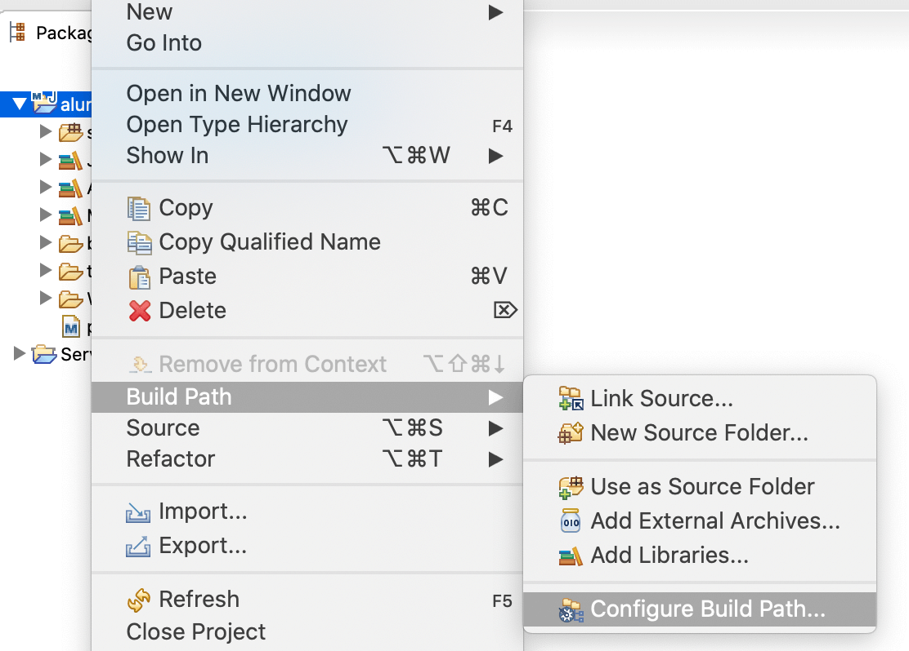
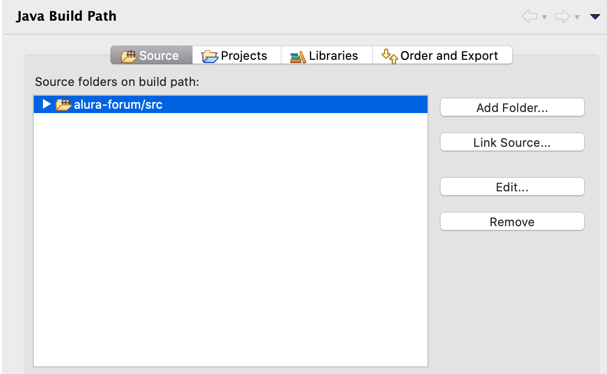
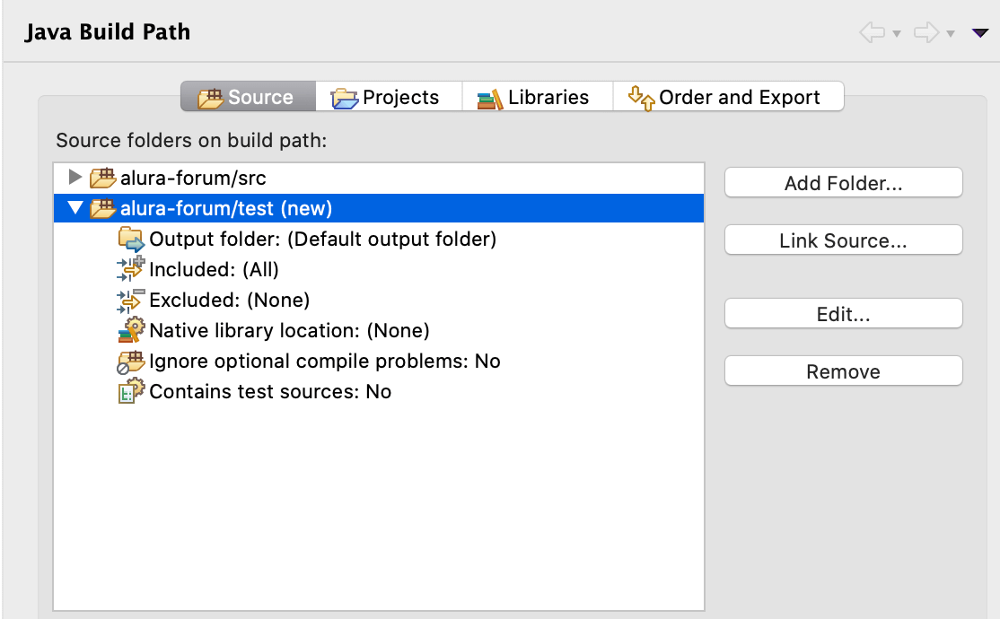
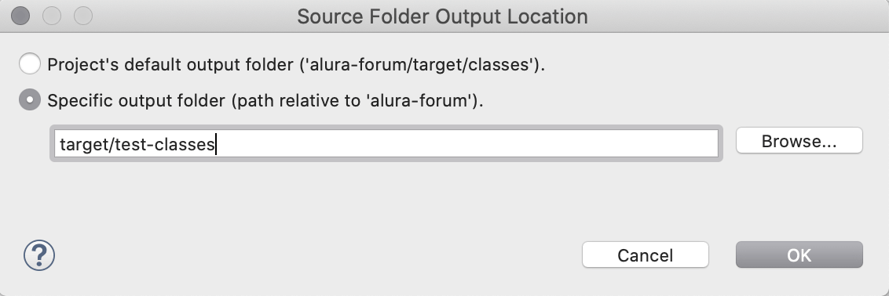
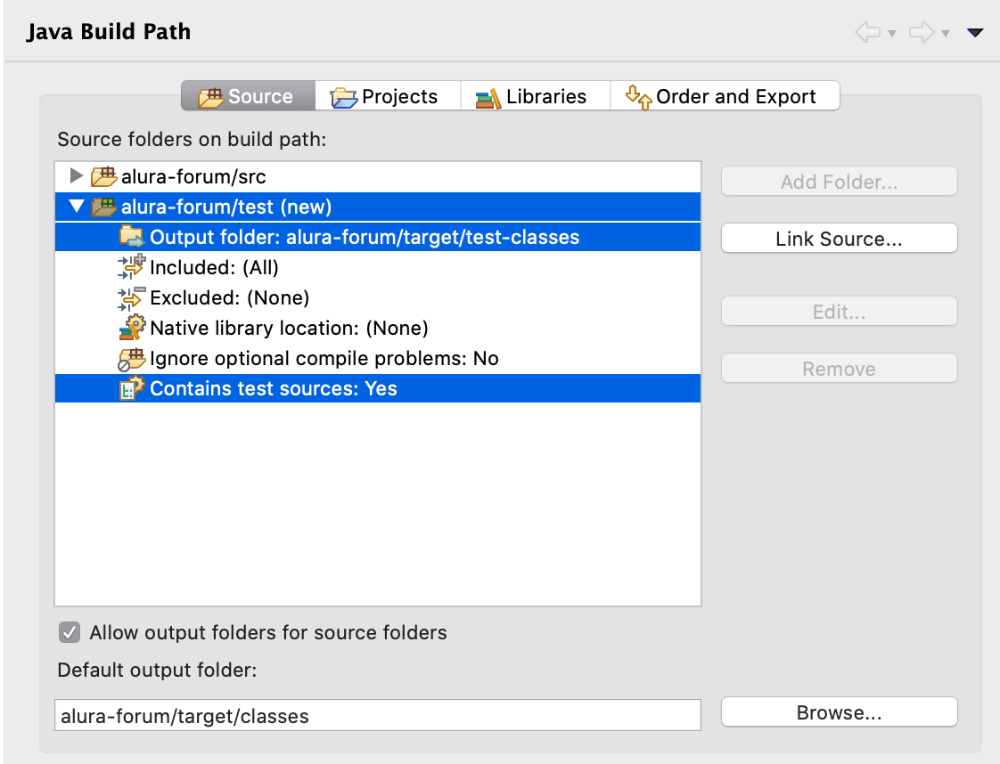
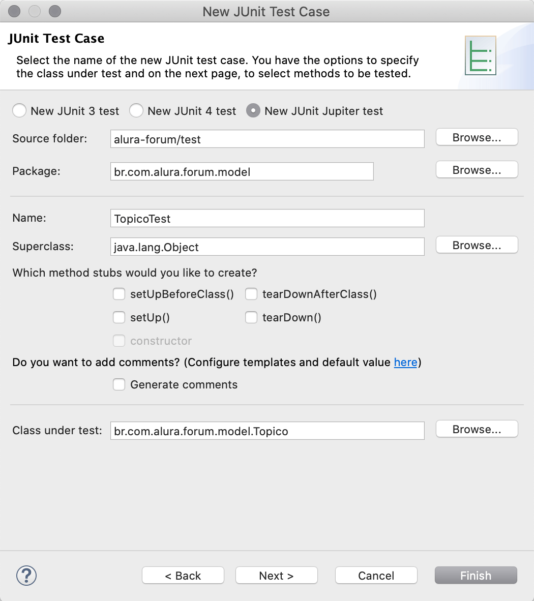

# Testes Automatizados

Neste capítulo vamos aprender sobre testes automatizados e o porquê dessa prática ser muito importante não somente para times DevOps, mas para qualquer projeto de software.

## O processo de desenvolvimento de um software

Desenvolver um software é um processo que envolve diversas atividades, tais como:

* Entender os problemas e necessidades de uma ou mais áreas de negócio da empresa;
* Pensar nas funcionalidades que serão necessárias para resolver tais problemas;
* Conversar com as pessoas das áreas de negócio para detalhar melhor tais problemas e as funcionalidades do software;
* Documentar esses problemas e as funcionalidades do software;
* Escrever o código de implementação de tais funcionalidades;
* Testar as funcionalidades para garantir a conformidade;
* Disponibilizar o software para os usuários; e
* Realizar correções e melhorias no software;

Perceba então como desenvolver um software não se resume a apenas escrever código e colocá-lo em produção. É um processo muito mais abrangente e **complexo**, pois envolve diversas áreas e pessoas que devem colaborar entre si para assim alcançar o resultado esperado.

Obviamente, em um processo complexo como esse, problemas e dificuldades vão surgir ao longo do caminho e devemos estar cientes de que isso é algo natural e inevitável.

## Funcionalidades e bugs

Um dos problemas que pode acontecer durante o desenvolvimento de um software são os **bugs**, que nada mais são do que erros inesperados que acontecem ao utilizar o software, sejam eles causados por problemas técnicos ou por não conformidade de regras de negócio.

É praticamente impossível desenvolver um software sem que bugs surjam ao longo do caminho. Devemos entender que isso faz parte do processo e não focar em evitar que bugs aconteçam, mas sim em como **minimizar** o número de bugs e, principalmente, em como **detectar rapidamente** quando um bug surgir, para que então o time consiga o resolver o mais rápido possível.

O ideal é que o próprio time de desenvolvimento detecte os bugs antes do código entrar em produção, evitando assim que os usuários da aplicação sejam prejudicados. Outra coisa importante é evitar que bugs que já foram corrigidos ocorram novamente na aplicação.

A principal maneira para lidar com bugs é a prática de se realizar **testes** durante o desenvolvimento das funcionalidades da aplicação. Esses testes podem ser realizados pela própria pessoa que desenvolveu a funcionalidade ou por alguém que tenha o perfil de *analista de testes*, e possua as habilidades necessárias para saber testar e encontrar bugs em funcionalidades de uma aplicação.

## Testes manuais e seus problemas

O problema da abordagem anterior é que ela é feita de maneira **manual**, ou seja, necessita que uma pessoa execute o passo a passo do teste na aplicação e verifique se tudo ocorreu conforme o esperado. Obviamente, isso para cada teste a ser realizado.

No início do projeto essa tarefa não vai consumir muito tempo e esforço do time de desenvolvimento, pois ainda existem poucas funcionalidades desenvolvidas, mas a medida que a aplicação crescer, com a implementação de novas funcionalidades, o esforço e tempo aumentarão proporcionalmente.

Uma aplicação grande e complexa, com inúmeras funcionalidades e regras de negócio complicadas, vai acabar exigindo centenas ou até milhares de *cenários de testes* para garantir que tudo funciona conforme o esperado.

É muito provável que apenas uma pessoa sozinha não seja capaz de realizar todos esses testes de maneira ágil, surgindo com isso a necessidade de se criar um time de testes, formado por pessoas que são especialistas em realizar testes em aplicações.

Além disso, há ainda um outro problema: sempre que alguém do time de desenvolvimento realiza uma alteração no código fonte da aplicação, existe o risco dessa alteração causar algum impacto no código já existente, gerando com isso novos bugs.

Ou seja, a cada nova mudança no código fonte da aplicação, **todos** os testes deveriam ser realizados novamente, pois não sabemos qual o impacto que essa mudança pode ter gerado. Isso é conhecido como teste de **regressão**, pois a ideia é regredir e testar novamente o que já havia sido testado anteriormente.

Obviamente, realizar testes de regressão manualmente da aplicação inteira a cada nova mudança é algo muito custoso, pois o esforço necessário será proporcional ao tamanho e complexidade do software, podendo em muitos casos ser inviável.

Perceba então como realizar testes de maneira manual em uma aplicação acaba se tornando uma tarefa muito difícil e insustentável no longo prazo.

Para piorar a situação, podemos ainda entrar no mérito de discutir sobre o *fator humano* envolvido nessa atividade, pois são pessoas que vão realizar tais testes, e as pessoas também erram. Pode haver o caso de alguém realizar algum teste de maneira errônea, identificando um bug que na verdade não existe ou o contrário, deixando passar de maneira despercebida um bug que deveria ter sido reportado.

## Testes automatizados

Perceba que realizar testes de funcionalidades de uma aplicação é uma tarefa repetitiva, pois sempre o mesmo passo a passo deverá ser executado. Justamente por isso é que devemos tentar **automatizar** essa tarefa, pois um computador é um especialista em executar tarefas repetitivas, de maneira muito mais ágil e confiável do que um ser humano. Seres humanos são melhores em tarefas que exigem criatividade e que, eventualmente, necessitam de *improvisos* :)

Não demorou muito para que as pessoas criassem ferramentas que automatizassem a execução de seus testes, nascendo assim o termo **testes automatizados**.

Um teste automatizado nada mais é do que um programa, ou seja, é um trecho de código que vai verificar se o seu código se comporta de acordo com as regras de negócio da aplicação, sempre gerando os resultados esperados para cada cenário possível.

Vamos a um exemplo: imagine que precisamos escrever um código para realizar o cálculo do desconto de um determinado produto, sendo que o desconto deve ser baseado no preço do produto. A regra determina que produtos cujo preço seja de até R$1000.00 não tem desconto, já produtos com preço superior a esse valor deve ter 10% de desconto.

Poderíamos ter a seguinte classe, em Java, para implementar essa funcionalidade:

```java
public class CalculadoraDeDesconto {

  private static final BigDecimal MIL_REAIS = new BigDecimal("1000.00");
  private static final BigDecimal DEZ_POR_CENTO = new BigDecimal("0.1");

  public BigDecimal valorDoDesconto(Produto produto) {
    BigDecimal precoDoProduto = produto.getPreco();

    if (precoDoProduto.compareTo(MIL_REAIS) <= 0) {
      return BigDecimal.ZERO;
    } else {
      return precoDoProduto.multiply(DEZ_POR_CENTO);
    }
  }

}
```

O código anterior aparenta estar correto e deveria funcionar de acordo com as regras de negócio da aplicação, mas podemos escrever um teste automatizado para ter certeza.

Em Java poderíamos escrever o seguinte código para realizar os testes:

```java
public class TestaDescontos {

  public static void main(String[] args) {
    Produto caneta = new Produto(new BigDecimal("2.5"));
    Produto celular = new Produto(new BigDecimal("1000"));
    Produto notebook = new Produto(new BigDecimal("5000"));

    CalculadoraDeDesconto calculadora = new CalculadoraDeDesconto();

    System.out.println(calculadora.valorDoDesconto(caneta));
    System.out.println(calculadora.valorDoDesconto(celular));
    System.out.println(calculadora.valorDoDesconto(notebook));
  }

}
```

Ao executar o código de teste anterior, teremos a seguinte saída no console:

```
0
0
500.0
```

Provando assim que realmente o código da classe `CalculadoraDeDesconto` está correto e funciona de acordo com as regras de negócio da aplicação.

Se alguma pessoa do time de desenvolvimento alterar o código da classe `CalculadoraDeDesconto` gerando, acidentalmente, um bug, ao executar novamente a classe de testes a saída será diferente, indicando assim a possível existência de um bug na aplicação.

Essa é a essência dos testes automatizados. Executar de maneira **ágil** os testes da aplicação e receber, também de maneira ágil, o **feedback** de que tudo continua funcionando normalmente ou de que algum problema surgiu.

Porém, podemos melhorar ainda mais a automatização desses testes, com a utilização de ferramentas criadas para esse objetivo, pois ainda estamos realizando alguns passos de maneira manual.

Por exemplo, o teste anterior está em uma classe Java com o método `main`, mas essa classe executa apenas os testes da classe `CalculadoraDeDesconto`. Em uma aplicação real teremos dezenas, centenas ou até milhares de outras classes contendo regras de negócio, e precisaríamos com isso ter uma classe de teste para cada classe dessa.

O problema é que teríamos que executar as classes de testes uma de cada vez, aumentando assim o tempo desse processo. Além disso, para saber se um teste deu certo, ou seja, se a classe testada está funcionando corretamente, devemos analisar o que foi impresso no console, e isso também para cada uma das classes de teste.

Aqui entra a necessidade de se utilizar alguma ferramenta que simplifique esse processo, para que possamos escrever, executar e analisar os testes de maneira ágil e eficiente.

Existem várias ferramentas que atendem a esse propósito, sendo elas conhecidas como ferramentas de **Unit Testing**. Dentre as principais estão:

* JUnit(Java)
* NUnit(.Net)
* PHPUnit(PHP)
* PyUnit(Python)

Como nossa aplicação utiliza a linguagem Java, utilizaremos então o JUnit como principal ferramenta para testes automatizados. No caso das outras linguagens de programação, as ferramentas são muito parecidas e ao aprender uma delas fica fácil aprender as outras também.

### JUnit

JUnit é um framework para testes automatizados em Java e foi criado em 1997 por Kent Beck e Erich Gamma durante um voo da Suíça para os Estados Unidos. O objetivo era criar um framework para escrever e executar testes automatizados em Java, de uma maneira que fosse simples e rápida.

Para entender melhor como funciona o seu funcionamento vamos refazer o teste automatizado do exemplo anterior, relacionado com a classe `CalculadoraDeDesconto`, porém dessa vez utilizando o JUnit.

Assim como no exemplo anterior, precisamos criar uma classe que vai conter os nossos testes, entretanto ao utilizar o JUnit não devemos criar uma classe com método `main`, mas sim uma classe Java comum:

```java
public class CalculadoraDeDescontoTest {

}
```

O nome da classe de teste, pela convenção, deve ser o mesmo nome da classe a ser testada, seguida pelo sufixo **Test**. Outra convenção é que as classes de teste fiquem separadas das classes sendo testada, geralmente utilizando-se para isso outro `source folder`.

Agora para cada cenário de teste devemos criar um método e adicionar nele a anotação do JUnit `@Test`:

```java
public class CalculadoraDeDescontoTest {

  @Test
  public void produtoBaratoNaoDeveriaTerDesconto() {
    Produto caneta = new Produto(new BigDecimal("2.5"));

    CalculadoraDeDesconto calculadora = new CalculadoraDeDesconto();

    BigDecimal desconto = calculadora.valorDoDesconto(caneta);
  }

}
```

O teste anterior ainda está incompleto, pois precisamos verificar se tudo saiu conforme o esperado, sendo que para isso devemos utilizar as classes de **assertivas** do JUnit:

```java
public class CalculadoraDeDescontoTest {

  @Test
  public void produtoBaratoNaoDeveriaTerDesconto() {
    Produto caneta = new Produto(new BigDecimal("2.5"));

    CalculadoraDeDesconto calculadora = new CalculadoraDeDesconto();

    BigDecimal desconto = calculadora.valorDoDesconto(caneta);

    Assertions.assertEquals(BigDecimal.ZERO, desconto);
  }

}
```

Agora o teste já está completo e podemos executá-lo. Embora as classes de teste não tenham o método `main`, as IDEs costumam ter integração com o JUnit e facilitam a execução dos testes.

No caso do Eclipse, basta clicar com o botão direito do mouse na classe e escolher a opção `Run As -> JUnit Test`.

Ao executar o teste anterior, o Eclipse nos exibirá a seguinte tela:


A barra horizontal na cor **verde** indica que os testes foram executados e as asserções estão corretas, nos indicando assim que nosso código funciona conforme o esperado.

Se alguma pessoa alterar o código da classe `CalculadoraDeDesconto` gerando um bug, ao executar novamente os testes teremos o seguinte resultado:


Repare como fica mais fácil de descobrir o bug e sua possível causa ao analisar esse relatório do JUnit.

Após corrigir o bug, podemos escrever os testes dos outros cenários que estão relacionados com a classe `CalculadoraDeDesconto`:

```java
public class CalculadoraDeDescontoTest {
  
  private CalculadoraDeDesconto calculadora;
  
  @BeforeEach
  public void beforeEach() {
    calculadora = new CalculadoraDeDesconto();
  }

  @Test
  public void produtoBaratoNaoDeveriaTerDesconto() {
    Produto caneta = new Produto(new BigDecimal("2.5"));
    
    BigDecimal desconto = calculadora.valorDoDesconto(caneta);
    
    Assertions.assertEquals(BigDecimal.ZERO, desconto);
  }
  
  @Test
  public void produtoQueCustaExatamente1000ReaisNaoDeveriaTerDesconto() {
    Produto caneta = new Produto(new BigDecimal("1000.00"));
    
    BigDecimal desconto = calculadora.valorDoDesconto(caneta);
    
    Assertions.assertEquals(BigDecimal.ZERO, desconto);
  }
  
  @Test
  public void produtoComPrecoMaiorQue1000ReaisDeveriaTerDescontoDe10PorCento() {
    Produto caneta = new Produto(new BigDecimal("2000.00"));
    
    BigDecimal desconto = calculadora.valorDoDesconto(caneta);
    BigDecimal descontoEsperado = new BigDecimal("200.00");
    
    Assertions.assertEquals(descontoEsperado, desconto);
  }

}
```

Agora sim estamos testando todos os cenários e nosso teste está muito mais confiável.

Repare que para evitar ficar repetindo o código que cria o objeto `CalculadoraDeDesconto` em todos os testes, o isolamos em um método anotado com `@BeforeEach`, ao qual o JUnit chama automaticamente antes de realizar cada um dos testes.

Porém, ao executar todos os testes veremos que um deles falha:


Na verdade o teste não falhou por conta de um bug na lógica do código da classe `CalculadoraDeDesconto`, mas sim por conta de um problema de arredondamento do valor retornado. Como estamos utilizando a classe `BigDecimal` do Java para representar os valores monetários, é recomendado indicar quantas casas decimais utilizaremos:

```java
public class CalculadoraDeDesconto {

  private static final BigDecimal MIL_REAIS = new BigDecimal("1000.00");
  private static final BigDecimal DEZ_POR_CENTO = new BigDecimal("0.1");

  public BigDecimal valorDoDesconto(Produto produto) {
    BigDecimal precoDoProduto = produto.getPreco();

    if (precoDoProduto.compareTo(MIL_REAIS) <= 0) {
      return BigDecimal.ZERO;
    } else {
      return precoDoProduto.multiply(DEZ_POR_CENTO).setScale(2, RoundingMode.HALF_UP);
    }
  }

}
```

Pronto! Feito esse ajuste os testes vão passar normalmente:


Perceba então como é muito mais simples utilizar uma ferramenta, como o JUnit, para escrever, executar e analisar o resultado dos testes automatizados em uma aplicação.

## Exercício: Configurando o projeto para os testes automatizados

Nesse exercício vamos adicionar um novo `source folder` em nossa aplicação, o qual será utilizado para as classes de testes automatizados.

1. Clique com o botão direito do mouse no projeto e selecione a opção: `Build Path -> Configure Build Path...`



2. Clique na aba superior `Source` e então clique no botão **Add Folder...**



3. Na janela que foi aberta, clique no botão **Create New Folder...**, adicione uma pasta chamada **test** e então clique no botão **Finish**.


4. Verifique na tela principal do `build path` se a nova pasta está sendo listada:



5. Dê um duplo clique na opção **Output folder** e altere-o conforme a imagem a seguir:



6. Dê um duplo clique na opção **Contains test sources** para alterar seu valor para **Yes** e confira se o novo source folder está configurado conforme a imagem a seguir:



7. Clique no botão **Apply and close** para finalizar a criação do novo source folder.

8. Agora, para finalizar, clique com o botão direito do mouse no projeto e selecione a opção **Maven -> Update Project...**.

## Exercício: Escrevendo testes automatizados na aplicação

Nesse exercício vamos escrever alguns testes automatizados em nossa aplicação utilizando o JUnit.

1. Primeiramente, precisamos adicionar o JUnit ao projeto. Abra o arquivo **pom.xml**, procure a seção de **dependências** e adicione o JUnit como dependência:

```xml
<dependency>
  <groupId>org.junit.jupiter</groupId>
  <artifactId>junit-jupiter-engine</artifactId>
  <version>5.6.0</version>
  <scope>test</scope>
</dependency>
```

2. Precisamos também adicionar o plugin do Maven responsável por executar os testes automatizados. Ainda no `pom.xml`, procure a seção de **plugins** e adicione o novo plugin:

```xml
<plugin>
  <groupId>org.apache.maven.plugins</groupId>
  <artifactId>maven-surefire-plugin</artifactId>
  <version>3.0.0-M4</version>
</plugin>
```

3. Agora já podemos escrever os testes automatizados utilizando o JUnit. A classe `Topico` é uma boa candidata para começarmos a escrever os testes, pois ela possui alguns métodos que contém regras de negócio da aplicação.

4. Clique com o botão direito em cima da classe **Topico**, que está localizada no pacote **br.com.alura.forum.model**, e escolha a opção **New -> Other... -> Junit Test Case**:



5. Repare que que o Eclipse já preencheu automaticamente as informações de maneira correta. Clique em **Finish** e verifique se a classe **TopicoTest** foi criada corretamente no pacote **br.com.alura.forum.model**, dentro do source folder **test**.

6. Apague o método `test()`, criado automaticamente como um exemplo, e crie o primeiro teste conforme o código a seguir:

```java
class TopicoTest {

  private Usuario joao;
  private Categoria frontend;
  private Categoria html;
  private Curso htmlBasico;
  
  @BeforeEach
  public void before() {
    this.joao = new Usuario("João", "joao@email.com.br", "123456");
    this.frontend = new Categoria("FRONT-END");
    this.html = new Categoria("HTML", frontend);
    this.htmlBasico = new Curso("HTML Básico", html);
  }

  @Test
  public void aoFecharUmTopicoSeuStatusDeveriaSerAlteradoParaFechado() {
    Topico duvida = new Topico("Dúvida HTML", "Qual tag utilizar?", joao, htmlBasico);
    
    duvida.fechar();
    
    Assertions.assertEquals(StatusTopico.FECHADO, duvida.getStatus());
  }

}
```

7. Execute o teste, clicando com botão direito na classe e escolhendo a opção **Run As -> JUnit Test**, e verifique se ele passa com sucesso.

8. Analise o código da classe **Topico** e verifique que outros testes poderiam ser criados. Discuta com os outros alunos(as) e instrutor(a) da turma sobre isso.

9. Lembre-se de fazer o commit das alterações no projeto:

```
git add .
git commit -m "criacao dos primeiros testes automatizados"
```

## Tipos de testes automatizados

Existem diversos tipos de testes automatizados que podemos escrever para verificar a corretude da aplicação, além de encontrar possíveis bugs. O tipo de teste que vimos na seção anterior é chamado de **teste de unidade**, também conhecido como teste unitário, sendo utilizado para testar classes e métodos de maneira isolada do resto do sistema.

Entretanto, existem outros tipos de testes que são mais complexos do que um simples teste de unidade e também são importantes, pois nem sempre conseguiremos testar uma classe de maneira isolada.

### Testes de unidade

Testes de unidade servem para testar apenas uma classe ou método, de maneira isolada das outras classes, verificando se seu comportamento está de acordo com o desejado. Nesse tipo de teste, verificamos a funcionalidade da classe e/ou método em questão passando o mínimo possível por outras classes ou dependências do nosso sistema.

> **Unidade?**
>
> Unidade é a menor parte testável de uma aplicação. Em uma linguagem de programação orientada a objetos, como o Java, a menor unidade é um método.
>
> O termo correto para esse tipo de teste é teste de unidade, porém o termo teste unitário propagou-se e é o mais encontrado nas traduções.

Em testes de unidade não estamos interessados no comportamento real das dependências da classe, mas em como a classe em questão se comporta diante das possíveis respostas das dependências, ou então, se a classe modificou as dependências da maneira esperada.

Para isso, quando criamos um teste de unidade, simulamos a execução de métodos da classe a ser testada. Fazemos isso passando parâmetros, caso necessário, ao método testado e definimos o resultado que esperamos. Se o resultado for igual ao que definimos como esperado, o teste passa. Caso contrário, falha.

Justamente por conta dessas características é que os testes de unidade são mais simples de escrever, além de também serem executados de maneira muito mais rápida.

### Testes de integração

Nem sempre será possível testar uma classe de maneira isolada, utilizando testes de unidade, pois é comum que algumas classes precisem se *integrar* com outras classes, módulos ou até mesmo outros sistemas externos.

Para esse tipo de classe um teste de unidade não vai funcionar, pois a essência dela é se integrar com "serviços" externos, não sendo possível assim executar seu código de maneira isolada.

Surge assim a necessidade de se escrever testes um pouco mais complexos que os testes de unidade, de maneira em que a integração que a classe faz possa também ser testada.

Esse tipo de teste é chamado de **teste de integração** e seu objetivo é testar justamente a integração entre classes, módulos e/ou serviços externos da aplicação.

Um exemplo de classe que precisaríamos testar via testes de integração são as classes **DAO**(Data Access Object), cujo objetivo é isolar o acesso ao banco de dados da aplicação.

A essência dessa classe é fazer o acesso ao banco de dados da aplicação, ou seja, ao executar os métodos dessa classe ocorrerá uma integração entre a aplicação e o banco de dados em si.

Vejamos um exemplo desse tipo de classe:

```java
@Repository
public class FaturaDao {

  @PersistenceContext
  private EntityManager em;

  public List<Fatura> buscarFaturasVencidas() {
    String jpql = "SELECT f FROM Fatura f WHERE f.dataVencimento < :hoje AND f.dataPagamento IS NULL";
    return em.createQuery(jpql, Fatura.class)
        .setParameter("hoje", LocalDate.now())
        .getResultList();
  }

}
```

Repare no código anterior que a classe possui um método chamado `buscarFaturasVencidas()`, cujo objetivo é carregar do banco de dados as faturas não pagas e já vencidas. Sempre que esse método for executado uma integração ao banco de dados será efetuada.

Para testar essa classe será necessário escrever um teste de integração. Entretanto, um teste de integração pode ser bastante complexo, dependendo do tipo de integração sendo realizada pela classe a ser testada.

Por exemplo, ao escrever o teste da classe `Dao` mostrada no exemplo anterior, os seguintes questionamentos e dificuldades poderão surgir:

* Como fazer com os parâmetros injetados na classe, por exemplo o `EntityManager`?
* O teste vai acessar o mesmo banco de dados utilizado pelo time de desenvolvimento?
* Os dados já existentes no banco de dados vão interferir nos testes?
* Seria melhor utilizar um outro banco de dados para os testes?

Todas essas questões devem ser levadas em consideração, para que assim seja possível saber como escrever os testes de integração.

Além de aumentar a dificuldade para escrever e dar manutenção no código desse tipo de teste, o tempo de execução dele será bem maior, se comparado aos testes de unidade.

### Mocks

Existe também o caso de algumas classes que se integram com outras, entretanto a integração em si não é o foco principal delas. Nesses casos é comum que a classe faça a integração apenas para buscar algum tipo de informação, utilizando então essa informação para executar alguma lógica.

Por exemplo, suponha que temos a seguinte classe:

```java
@Service
public class ProcessadorDePagamentos {

  private PagamentoService pagamentoService;

  @Autowired
  public ProcessadorDePagamentos(PagamentoService pagamentoService) {
    this.pagamentoService = pagamentoService;
  }

  public void processarPagamentos(List<Fatura> faturas) {
    for(Fatura atual : faturas) {
      Pagamento recebido = pagamentoService.buscarPagamentoDaFatura(atual);
      if (recebido != null) {
        atual.setDataPagamento(recebido.getData());
        atual.setValorPago(recebido.getValor());
        atual.setStatus(StatusFatura.PAGO);
      }
    }
  }

}
```

A classe anterior tem como objetivo buscar o pagamento de determinadas faturas e, caso elas tenha sido pagas, atualizar suas informações.

Para realizar esse trabalho ela precisa utilizar uma outra classe, que no caso é a classe `PagamentoService`, que é responsável por buscar o pagamento de determinada fatura. Sendo assim, perceba então que existe uma integração entre as classes `ProcessadorDePagamentos` e `PagamentoService`.

Porém, ao testar essa classe não estamos interessados na integração dela com a classe `PagamentoService`, mas sim na sua lógica interna, que representa uma regra de negócio da aplicação.

O objetivo agora é escreve um teste de unidade para essa classe, mas para isso precisamos **isolar**, de alguma maneira, as dependências dela.

Para nos ajudar com isso foi criado um conceito chamado de **Mock**, que nada mais é do que uma classe que vai **simular** o comportamento de outra classe. É como se fosse um **dublê** de filmes, que atua no lugar do ator ou atriz em determinadas cenas.

Poderíamos criar uma classe chamada `PagamentoServiceMock`, que seria utilizada como `mock` da classe `PagamentoService`, e então ao testar a classe `ProcessadorDePagamentos` utilizaríamos a classe `mock` e não a classe verdadeira.

Já existem bibliotecas de `mock` que fazem esse trabalho automaticamente, como por exemplo o **Mockito**, no caso do Java.

Veja um exemplo de teste de unidade da classe `ProcessadorDePagamento` utilizando o Mockito:

```java
@RunWith(MockitoJUnitRunner.class)
public class ProcessadorDePagamentoTest {

  @Mock
  private PagamentoService pagamentoServiceMock;

  private ProcessadorDePagamentos processador;

  @BeforeEach
  public void before() {
    processador = new ProcessadorDePagamentos(pagamentoServiceMock);
  }

  @Test
  public void faturaNaoPagaDeveriaManterSeusDadosInalterados() {
    Fatura contaDeLuz = new Fatura("Conta de Luz", new BigDecimal(105.90));
    List<Fatura> faturas = Arrays.asList(contaDeLuz);

    //configurando comportamento do mock:
    Mockito.when(pagamentoServiceMock.buscarPagamentoDaFatura(contaDeLuz)).thenReturn(null);

    processador.processarPagamentos(faturas);

    Assertions.assertNull(contaDeLuz.getDataPagamento());
    Assertions.assertNull(contaDeLuz.getValorPago());
    Assertions.assertEquals(StatusFatura.EM_ABERTO, contaDeLuz.getStatus());
  }

}
```

Repare no código anterior que antes de chamar o método `processarPagamentos()` configuramos o `mock` com o comportamento que desejamos para esse cenário de teste.

Com isso o teste se comportará como um simples teste de unidade, pois a integração não ocorrerá de verdade, uma vez que estamos utilizando um `mock` e não a classe verdadeira.

### Testes de aceitação

Nem sempre testar as classes de maneira isolada, com testes de unidade, e de maneira integrada, com testes de integração, significa que a aplicação está funcionando corretamente e sem bugs.

Isso porque, até então, não fizemos um teste do ponto de vista do usuário da aplicação, que seria bem mais realista. Todos os testes que vimos até o momento são focados no código da aplicação, sendo que os usuários não tem acesso diretamente e ele.

Um usuário utiliza a aplicação por meio de sua interface gráfica, por exemplo utilizando um browser, no caso de uma aplicação Web, e por meio dessa interface ele interage com suas funcionalidades.

Faz sentido então criar testes que sejam mais realistas, ou seja, que simulem o uso do software de maneira mais próxima possível a como os usuários a utilizam.

Esse tipo de teste é chamado de **teste de aceitação**, também conhecido como **teste de sistema** ou até mesmo como **teste end-to-end**, uma vez que ele testa a aplicação de ponta a ponta.

Para escrever testes de aceitação automatizados será necessário utilizar alguma ferramenta que consiga interagir com a interface gráfica da aplicação, como por exemplo o **Selenium WebDriver**. Esse tipo de ferramenta é capaz de interagir com o browser, acessando URLs, preenchendo formulários, clicando em botões e links, localizando informações na página, etc.

O problema desse tipo de teste é que ele costuma ser bem mais trabalhoso de escrever e dar manutenção, além de exigir do time de desenvolvimento que aprenda uma nova ferramenta para a escrita dos testes, como o Selenium WebDriver.

Além disso, como esse teste vai simular um usuário navegando pela aplicação e interagindo com suas funcionalidades, ele tende a ser bem demorado para executar. Enquanto um teste de unidade é executado em milissegundos, um teste de aceitação pode levar de segundos a minutos para ser executado completamente.

Vejamos um exemplo de teste de aceitação escrito na linguagem Java com a utilização da biblioteca Selenium WebDriver:

```java
public class ListagemDeClientesTest {

  private WebDriver browser;

  @BeforeEach
  public void before() {
    this.browser = new ChromeDriver();
    browser.navigate().to("http://localhost:8080/sistema");
  }

  @Test
  public void deveriaExibirAListaDeClientes() {
    //clica no menu para abrir a pagina de clientes
    browser.findElement(By.id("menu-clientes")).click();

    //recupera o titulo principal da pagina
    WebElement titulo = browser.findElement(By.tagName("h1"));

    //recupera a listagem de clientes
    WebElement tabela = browser.findElement(By.id("tabela-clientes"));

    //verifica se o titulo da pagina esta correto
    Assertions.assertEquals("Lista de clientes cadastrados", titulo.getText());

    //verifica se a listagem de clientes foi encontrada na pagina
    Assertions.assertNotNull(tabela);
  }

}
```

Repare no código anterior que existe um acoplamento forte entre o teste e os componentes visuais da página. Qualquer alteração feita no front-end da aplicação pode fazer com que vários testes falhem, tornando assim esse tipo de teste bem *frágil*.

## Exercício: Testes automatizados com Mockito

Nesse exercício vamos escrever mais um teste de unidade, entretanto dessa vez será necessário a utilização de mocks e portanto utilizaremos a biblioteca Mockito.

1. Primeiramente, precisamos adicionar o Mockito como dependência do projeto. Abra o arquivo **pom.xml** e adicione mais uma dependência:

```xml
<dependency>
  <groupId>org.mockito</groupId>
  <artifactId>mockito-junit-jupiter</artifactId>
  <version>3.2.4</version>
  <scope>test</scope>
</dependency>
```

2. A classe que vamos testar será a **DashboardService**, que está localizada no pacote **br.com.alura.forum.service**. Clique com o botão direto nela e escolha a opção **New -> Other... -> JUnit Test Case**.

3. Apague o método de exemplo que foi criado automaticamente e escreva o seguinte código:

```java
@ExtendWith(MockitoExtension.class)
class DashboardServiceTest {

  @InjectMocks
  private DashboardService dashboardService;

  @Mock
  private CategoriaDao categoriaDao;

  @Mock
  private TopicoDao topicoDao;

  private List<Categoria> categorias;

  @BeforeEach
  public void before() {
    Categoria backend = new Categoria("Back-End", null);
    Categoria frontend = new Categoria("Front-End", null);
    Categoria mobile = new Categoria("Mobile", null);

    this.categorias = Arrays.asList(backend,frontend, mobile);
  }

}
```

4. Agora que já configuramos o mockito para injetar os mocks, podemos escrever os nossos testes. Vamos testar se o `DashboardService` devolve as categorias com os contadores zerados, no caso de não haver nenhum tópico cadastrado:

```java
@Test
  public void contadoresDeveriamEstarZeradosNoCasoDeNaoHaverTopicosAbertos() {
    Mockito.when(categoriaDao.buscarTodasAsCategoriasPrincipais()).thenReturn(categorias);
    categorias.forEach(c -> {
      Mockito.when(topicoDao.countPorCategoria(c)).thenReturn(0l);
      Mockito.when(topicoDao.countPorCategoriaEAbertosNaUltimaSemana(c)).thenReturn(0l);
      Mockito.when(topicoDao.countPorCategoriaENaoRespondidos(c)).thenReturn(0l);
    });

    List<DashboardItem> dashboard = dashboardService.buscarDadosDoDashboardDeTopicos();

    Assertions.assertEquals(3, dashboard.size());
    dashboard.forEach(d -> {
      Assertions.assertEquals(0, d.getQtdTopicos());
      Assertions.assertEquals(0, d.getQtdTopicosDaUltimaSemana());
      Assertions.assertEquals(0, d.getQtdTopicosNaoRespondidos());
    });
  }
```

5. Que outros cenários poderíamos testar? Discuta com os outros alunos(as) e instrutor(a) da turma sobre isso.

6. Não se esqueça de fazer o commit das alterações no projeto!

BOX:Piramide de testes

## Cobertura de testes

## Exercício

## Métrica: Change Failure Rate